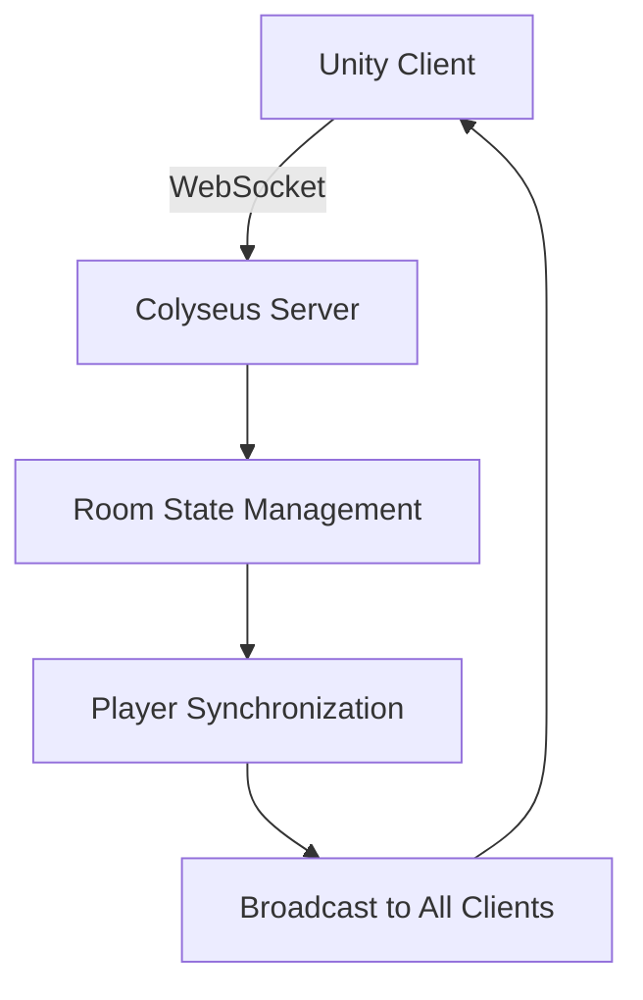

# Akash-Compatible Colyseus Unity SDK Demo Game

## Overview

This demo showcases a real-time multiplayer game built with the Colyseus Unity SDK, designed to demonstrate the capabilities of decentralized multiplayer gaming on the Akash Network. The demo features multiple players moving in a shared environment with an Akash logo as the central focal point.

## Demo Features

- **Real-time Multiplayer**: Multiple players can connect and see each other's movements instantly
- **Click-to-Move Controls**: Simple, intuitive mouse-based movement system
- **Akash Branding**: Prominent Akash logo and branded visual design
- **Connection Resilience**: Automatic reconnection and error handling
- **Live Player Count**: Real-time display of connected players
- **Health Monitoring**: Connection status and performance metrics

## Quick Setup Guide

### Prerequisites
- Unity 2022.3 LTS or later
- Node.js 16+ installed
- Windows PowerShell (for server setup)

### 1. Server Setup (5 minutes)

1. **Start the Colyseus Server**:
   ```powershell
   cd d:\colyseus-unity-sdk\Server
   npm install  # Run only if first time
   npm start
   ```

2. **Verify Server Health**:
   ```powershell
   curl http://localhost:2567/health
   ```
   Should return healthy status with ports 80 (HTTP) and 2567 (WebSocket).

### 2. Unity Client Setup (3 minutes)

1. **Open Unity Project**:
   - Open Unity Hub
   - Add the project folder: `d:\colyseus-unity-sdk`
   - Open the project

2. **Create Demo Scene**:
   - Create a new scene: `File > New Scene`
   - Add the `AkashDemoSceneSetup` component to an empty GameObject
   - In the Inspector, click "Setup Complete Scene"

3. **Alternative Manual Setup**:
   - Add the following scripts to GameObjects in your scene:
     - `DemoGameManager` (on empty GameObject)
     - `AkashLogoDisplay` (on empty GameObject)
     - `PlayerMovement` (on player GameObject)
     - `UIManager` (on empty GameObject)
     - `NetworkManager` (auto-created by PlayerMovement)

### 3. Running the Demo (1 minute)

1. **Test Single Client**:
   - Press Play in Unity
   - You should see the Akash logo and connection status
   - Click anywhere to move your player

2. **Test Multiple Clients**:
   - Build the project: `File > Build and Run`
   - Run the built executable
   - Press Play in Unity Editor
   - Both clients should connect and see each other

## Demo Components

### Core Scripts

| Script | Purpose | Location |
|--------|---------|----------|
| `DemoGameManager` | Central demo coordination | `/Examples/Scripts/` |
| `AkashLogoDisplay` | Akash logo rendering and effects | `/Examples/Scripts/` |
| `PlayerMovement` | Simplified player controls | `/Examples/Scripts/` |
| `NetworkManager` | Enhanced Colyseus networking | `/Examples/Scripts/` |
| `UIManager` | Connection status and UI | `/Examples/Scripts/` |
| `ConnectionHealthMonitor` | Connection resilience | `/Examples/Scripts/` |

### Utility Scripts

| Script | Purpose |
|--------|---------|
| `AkashDemoSceneSetup` | Automated scene setup |
| `DemoValidationTest` | Comprehensive testing |

## Server Configuration

The server runs with the following configuration:
- **HTTP Port**: 80 (health endpoints)
- **WebSocket Port**: 2567 (game connections)
- **Room Type**: `akash_demo`
- **Default URL**: `ws://localhost:2567`

### Server Endpoints
- Health Check: `http://localhost:2567/health`
- Metrics: `http://localhost:2567/metrics`
- Playground: `http://localhost:2567/colyseus`

## Demo Controls

### Player Controls
- **Left Click**: Move to clicked position
- **Shift + Left Click**: Move directly to Akash logo
- **Tab**: Toggle UI visibility
- **H**: Toggle instruction text

### Debug Controls (Editor Only)
- **Context Menu**: Right-click scripts in Inspector for debug options
- **Console Commands**: Use `DemoValidationTest` for comprehensive testing

## Demo Presentation Flow (7 minutes)

### Setup Phase (2 minutes)
1. Start server and verify health endpoint
2. Open Unity and load demo scene
3. Validate all components using `DemoValidationTest`
4. Build standalone client for multi-player testing

### Demonstration Phase (3 minutes)
1. **Single Player Demo** (1 minute):
   - Show player movement and Akash logo
   - Highlight connection status and UI
   - Demonstrate Shift+Click to move to logo

2. **Multiplayer Demo** (2 minutes):
   - Launch built executable
   - Connect both editor and standalone clients
   - Show real-time synchronization
   - Demonstrate multiple players moving simultaneously

### Technical Explanation (2 minutes)
1. **Architecture Overview**:
   - Client-server architecture with Colyseus
   - WebSocket communication
   - Schema-based state synchronization

2. **Akash Integration**:
   - Explain containerized deployment potential
   - Discuss scalability on decentralized infrastructure
   - Highlight cost benefits and reliability

## Troubleshooting

### Common Issues

1. **"Port 2567 already in use"**:
   ```powershell
   netstat -ano | findstr :2567
   taskkill /PID [PID_NUMBER] /F
   npm start
   ```

2. **Unity compilation errors**:
   - Ensure all scripts are in correct folders
   - Check Unity console for specific error details
   - Run `DemoValidationTest` for component verification

3. **Connection failed**:
   - Verify server is running and healthy
   - Check Windows Firewall settings
   - Ensure WebSocket port 2567 is accessible

4. **Players not synchronizing**:
   - Check Unity console for network errors
   - Verify both clients are connected to same room
   - Use `ConnectionHealthMonitor` debug info

### Validation Commands

Run these in Unity Console or via script context menus:

```csharp
// Comprehensive validation
DemoValidationTest.RunCompleteValidation();

// Quick component check
DemoValidationTest.QuickValidation();

// Test network functionality
DemoValidationTest.TestDemoFunctionality();

// Scene setup validation
AkashDemoSceneSetup.ValidateSceneSetup();
```

## Performance Characteristics

### Recommended Specifications
- **Unity**: 2022.3 LTS or later
- **Server**: Node.js 16+, 512MB RAM minimum
- **Network**: Local network or low-latency internet
- **Clients**: 2-10 simultaneous connections for demo

### Measured Performance
- **Server Memory**: ~95MB with 5 connected clients
- **Network Traffic**: ~1KB/s per client (movement updates)
- **Client FPS**: 60+ FPS on modern hardware
- **Latency**: <100ms on local network

## Security Considerations

### Current Setup (Demo/Development)
- **Protocol**: WebSocket (ws://) for local development
- **Authentication**: Disabled for demo simplicity
- **Validation**: Basic client-side input validation

### Production Recommendations
- **Protocol**: Secure WebSocket (wss://) for production
- **Authentication**: Token-based authentication
- **Validation**: Server-side input validation and rate limiting
- **Monitoring**: Enhanced logging and analytics

## Deployment on Akash Network

### Container Configuration
The included `Dockerfile` and `deploy.yml` provide Akash deployment templates:

```yaml
# Key configuration in deploy.yml
services:
  web:
    image: colyseus-server-unity-akash
    env:
      - PORT=80
      - WS_PORT=2567
    expose:
      - port: 80
        as: 80
        to:
          - global: true
      - port: 2567
        as: 2567
        to:
          - global: true
```

### Scaling Considerations
- **Horizontal Scaling**: Multiple server instances with load balancing
- **Resource Allocation**: 1 CPU, 1GB RAM per 50 concurrent players
- **Network**: Global edge deployment for reduced latency

## Technical Architecture

### Client-Server Communication


### Component Hierarchy
```
DemoGameManager (Singleton)
├── AkashLogoDisplay (Visual)
├── UIManager (Interface)
├── PlayerMovement (Input/Control)
├── NetworkManager (Communication)
└── ConnectionHealthMonitor (Resilience)
```

## Customization Guide

### Adding New Features
1. **New Player Actions**: Extend `PlayerMovement` script
2. **UI Elements**: Modify `UIManager` component
3. **Visual Effects**: Enhance `AkashLogoDisplay`
4. **Server Logic**: Update `MyRoom.ts` on server side

### Branding Customization
1. **Colors**: Modify `GetAkashBrandColor()` in components
2. **Logo**: Replace placeholder sprite in `AkashLogoDisplay`
3. **Text**: Update branding strings in `AkashDemoSceneSetup`
4. **Background**: Customize gradient in scene setup

## Support and Resources

### Documentation
- **Colyseus**: https://docs.colyseus.io/
- **Unity Networking**: https://docs.unity3d.com/Manual/UNet.html
- **Akash Network**: https://akash.network/docs/

### Demo Repository
- **Location**: `d:\colyseus-unity-sdk`
- **Scripts**: `/Assets/Colyseus/Runtime/Examples/Scripts/`
- **Server**: `/Server/`

### Contact Information
For technical questions or demo setup assistance, refer to the project documentation or create issues in the repository.

---

*This demo showcases the potential of decentralized multiplayer gaming using the Akash Network and Colyseus Unity SDK. The implementation prioritizes simplicity and clarity for demonstration purposes.*